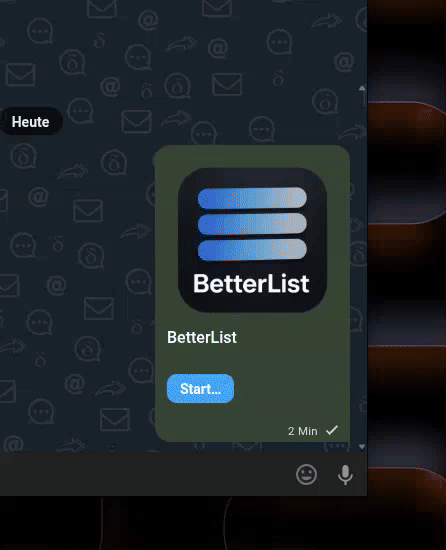

# BetterList
A collaborative [Webxdc](https://webxdc.org/) list app for tasks, groceries, and more.

### Features
* Collaborative, end-to-end encrypted list editing in Webxdc-compatible messengers
* Convenient features like removal of all checked items and sorting by checked/unchecked
* Localized in 11 languages

### How it looks

### Built with AI
Vibe-coded using *Qwen 3.6 Plus* and *Claude Sonnet 4.6*, as current LLMs excel at creating single-page web apps that run in an sandboxed environment.
